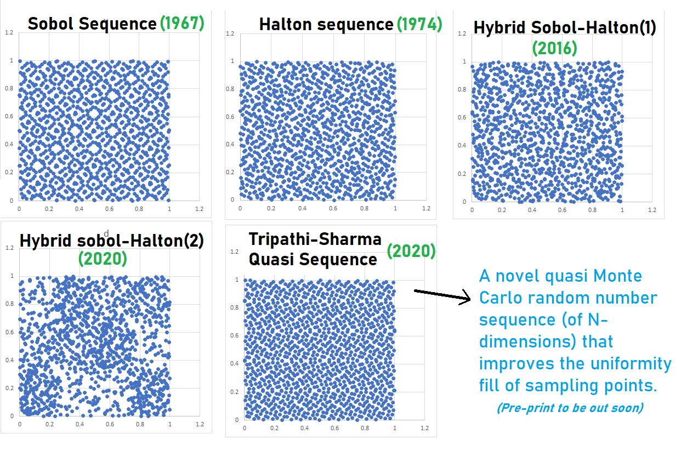

# Randomwalks
Random Walk strategies for optimization algorithms using **Low-Discrepancy Sequences and quasi-Monte Carlo simulations**.
Sobol quasi-random sequence was developed in 1967. Since then, it has evolved. I have contributed to the method by adding two-quasi Monte Carlo sequences in the original version to improve the uniformity in distribution. I am calling this improvement as Sanitized-SOBOL method.

### NOVEL TRIPATHI-SHARMA QUASI SEQUENCE

## Usage Method : 
* The method i4_sobol_generate(dim,PopSize,0) generates a Sobol dataset.
-      Inputs: 
      dim_num - the spatial dimension, 
      n - (int) number of points to generate; SKIP
      no. of initial points to skip.
-      Output: 
      Real R(M,N), the point
      Usage : df1 = i4_sobol_generate(dim,PopSize,0). e.g. df = i4_sobol_generate(3,4,1)_

### Note : 
If you like this project then please leave a Star (Top right corner) to show your appreciation !
Citation details to be out soon on pre-print launch
